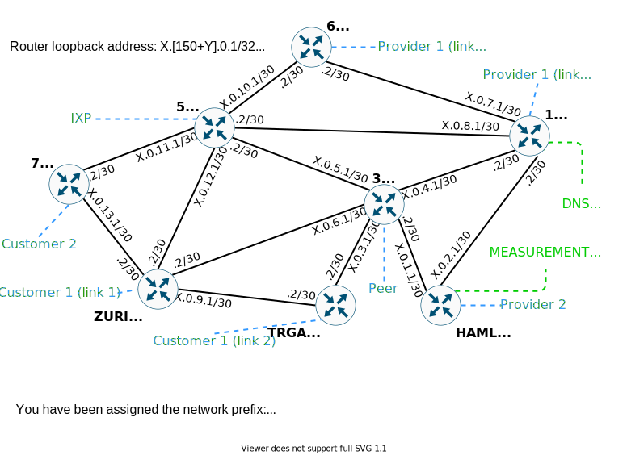

This directory contains the configuration files used for COMPX304-21B

```./generate_connections.py``` generates the mini-Internet internet
configuration. I.e. the number of ASes and how they are connected to each
other.  At the start of ```./generate_connections.py``` there are examples that
generate networks of different sizes.

For example:
```
config_transit=False
# 12 ASes, 4 student ASes
transit = [[1,2,3,4,5,6],[11,12,13,14,15,16]]
ixp_central = 80
ixp_out = [81,82]
name="12"
```
```transit``` specifies the ASes numbers in each block, despite the name
this includes more than just transit networks. You can skip numbers in
these blocks. For example, you might want to align blocks on multiples of 10.
```tier1``` should be set to the first two ASes from each block. The last two
ASes from each block are stubs. Therefore, every block has 4 unusable ASes.
There is one central IXP, ```ixp_central``` configures the AS number.
```ixp_out``` configures the AS numbers for the IXPs between each block, there
should be one ```ixp_out``` for each block. ```name``` is included in the
output file names.  When numbering ASes avoid AS 99 as the ssh 52099 port is
used for the measurement host.

Make sure to set ```config_transit=False``` for the final configuration.  And
update ```welcoming_message.txt``` with the correct contact details.

Copy the generated ```AS_config.txt``` and ```external_links_config.txt```
(remove the '.72' ```name```/size) files into the platform/config/ directory
along with the other static configuration files,
```internal_links_config.txt``` etc.  ```external_links_config_students.txt```
is for the webserver, after sorting by the AS, to let students know how their
AS is connected to others.

At a minimum always allow four or more extra transit/student networks than
students. You will use these extra networks for marking and testing
labs/assignments yourself. This also leaves space for late enrolments. But,
consider allowing even more so that you can intersperse fully configured ASes
within the transit ASes.

Because not all students attempt the assignment at the same time.  In 2020,
some students ended up with very few BGP neighbours that they could speak with.
In 2021, I allocated ~2 extra ASes per block (6 blocks) and automatically
configured these. This allowed me to ensure that every student had at least one
fully configured neighbour in their block. You can configure these extra ASes
after starting the mini-Internet once students have completed their OSPF
assignment. In 2021, for a class of 33, I configured the mini-Internet with
48 student ASes.


### The 304 mini-Internet configuration
Here is the network layout as defined by the scripts in this folder.

The standard mini-Internet project provides every student with a layer 2
network and a layer 3 network. COMPX304 uses the layer 3 routers as per the
original intention of the project, for the OSPF and BPG assignment. COMPX304
repurposes the layer 2 network as the lab network; which is no longer a layer 2
network as it includes Linux routers. The lab network is connected to the layer
3 network via the TRGA router. However, this link remains unused in COMPX304 as
that adds unnecessary complexity.

The lab tasks and assignments remain similar to previous years, but I have
updated them for the mini-Internet.

## Lab network layout
```
                                     ┌────────┐    ┌────────┐
                                     │        │    │        │
                                     │upstream│    │  TRGA  │
                                     │        │    │        │
                                     └────┬───┘    └───┬────┘
                                          │            │
                                         ═╧══════╤═════╧═
                                        North Net│
     ┌────────┐                                  │        ┌────────┐
     │        │ ┏━━━━━━━━━━━━━┓           ┏━━━━━━┷━━━━━━┓ │        │
     │ west-1 │ ┃             ┃           ┃             ┃ │ east-1 │
     │        │ ┃ west-router ┃           ┃ east-router ┃ │        │
     └────┬───┘ ┃             ┃           ┃             ┃ └───┬────┘
          │     ┗┯━━━━━━━━━━━┯┛           ┗┯━━━━━━━━━━━┯┛     │
          │      │           │ Middle Net  │           │      │
    ══════╧════╤═╧══       ══╧═╤═════════╤═╧══       ══╧══╤═══╧═══════
     West Net  │               │         │                │  East Net
            ┌──┴─────┐     ┌───┴───┐ ┌───┴───┐       ┌────┴───┐
            │        │     │       │ │       │       │        │
            │ west-2 │     │ mid-1 │ │ mid-2 │       │ east-2 │
            │        │     │       │ │       │       │        │
            └────────┘     └───────┘ └───────┘       └────────┘
```

I did not use the north net and the upstream host for the labs. However,
including them leaves the option open to run the NAT lab and use it in the
firewall lab.


## Layer 3 layout



The layer 3 layout is based on ETH Zurich's 2020 network systems paper network
layout. With routers renamed, the MIAM and GENE routers are replaced with TRGA
and HAML. I also updated subnets to /30s for links and /32s for loopbacks.

## Internet layout


The Internet layout is based on ETH Zurich's 2020 network systems paper network
layout. In 2021, I scaled this to 72 ASes of which 48 ASes were transit. In
2020, I scaled this to 84 for a total of 60 student ASes.

To generate the network diagram, I have used https://www.diagrams.net/, you
should be able to open the .drawio files included and modify these to fit the
network size you create. Unfortunately, drawing the diagram remains manual.

## Configuration Files

The configuration files are documented here:
[./platform/README.md](./platform/README.md).
```layer2_hosts_config.txt.extra``` is a new configuration file for 304.

### Layer2_hosts_config.txt.extra

The default mini-Internet configuration allows hosts to be plugged into
switches in the layer2 network. For the 304 labs, we use the layer2 network, it
is no longer a layer2 network as students use the Linux hosts as routers.
```layer2_hosts_config.txt.extra``` is a new configuration file that allows a
host to be plugged into more than a single switch and be used as a router.
For all other configuration files refer to the mini-Internet documentation.